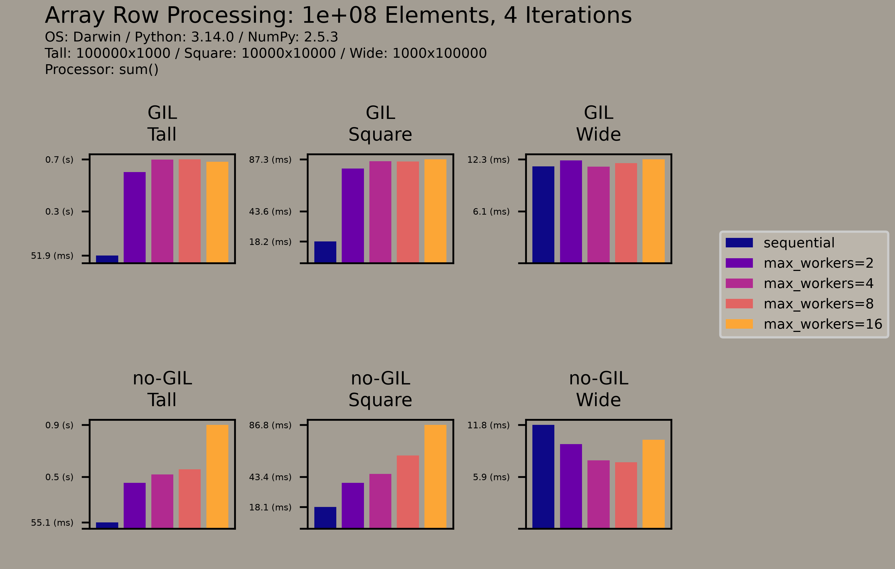
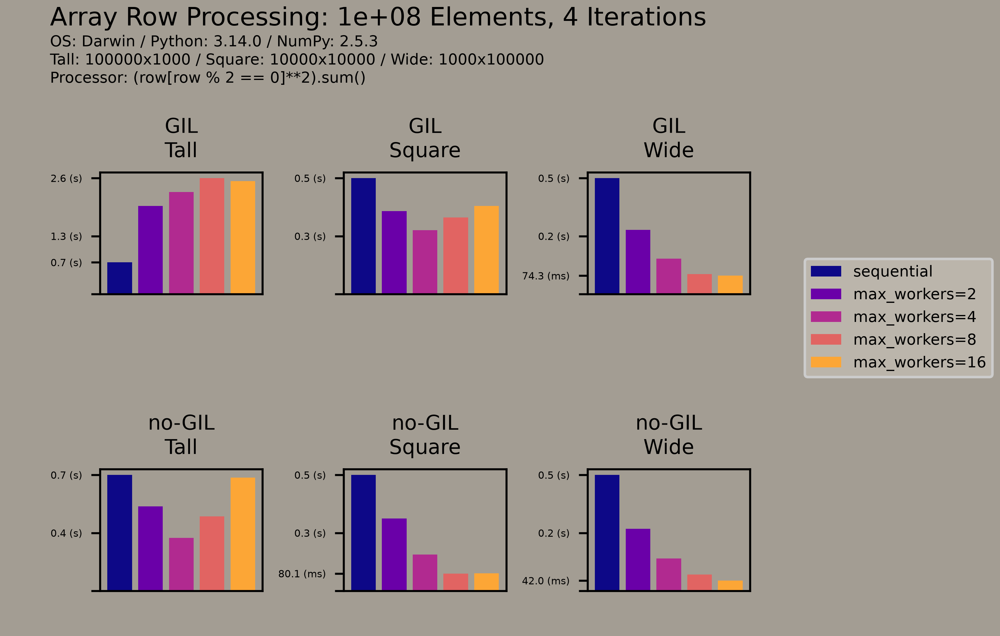
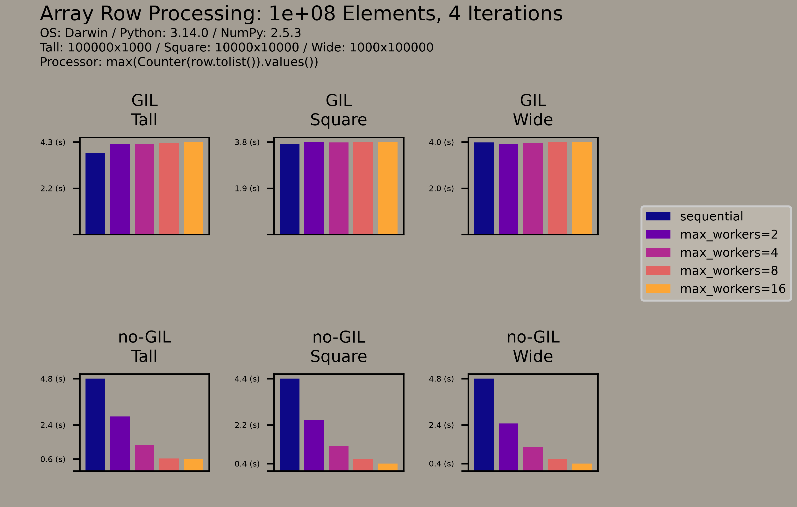

# Getting Started with Free-Threaded Python Using NumPy

Christopher Ariza
PyBay 2026

**Slides (PDF):** [gswftpun.pdf](gswftpun.pdf)

## Summary

Conventional Python offers two options for concurrency, and both fall short for CPU-bound work. Multithreading is throttled by the Global Interpreter Lock (GIL), and multiprocessing pays significant startup and memory overhead. Free-threaded Python (experimental in 3.13, supported in 3.14) removes the GIL. This talk shows how to start using it for row-wise processing of NumPy arrays, a pattern that generalizes to DataFrames, database records, and many other cases.

The talk covers:

- **Running free-threaded Python:** installing the `python3.14t` binary, discovering whether the running interpreter is free-threaded, and how the GIL can be re-enabled at startup or runtime by importing an incompatible C extension. It also covers how C extensions declare compatibility, and why being compatible does not mean being thread-safe.
- **Using `ThreadPoolExecutor`:** `map()` and `submit()`, applying a function to each row of a 2D array with `np.fromiter()`, and tuning `max_workers` for CPU-bound work.
- **Performance panels:** three per-row functions that create progressively more Python objects, each run on tall, square, and wide arrays of 100 million elements sequentially and with 2, 4, 8, and 16 threads, under both `python3.14` and `python3.14t`.
- **When multi-threading goes wrong:** thread overhead that exceeds the unit of work, and data races from in-place mutation that the GIL used to hide.
- **Bridging GIL and free-threaded environments:** checking `sys._is_gil_enabled()` before threading, or using `ConditionalThreadPoolExecutor` from [`conditional-futures`](https://pypi.org/project/conditional-futures/) to thread only when the GIL is disabled.

## Performance Panels

Each panel plots runtime (lower is faster) for tall, square, and wide arrays, with the GIL build (top row) above the free-threaded build (bottom row). The bars compare sequential processing with `max_workers` of 2, 4, 8, and 16. The more each row costs to process, the more threads help, and creating Python objects is a significant part of that cost.

### One `PyObject` per row: `row.sum()`

### A few `PyObject`s per row: `(row[row % 2 == 0] ** 2).sum()`

### Many `PyObject`s per row: `max(Counter(row.tolist()).values())`

## Repository Contents

- [`doc/pybay/`](doc/pybay/): the [Slidev](https://sli.dev) source for the slides (`slides.md`)
- [`src/`](src/): scripts for the benchmarks and data-race examples
